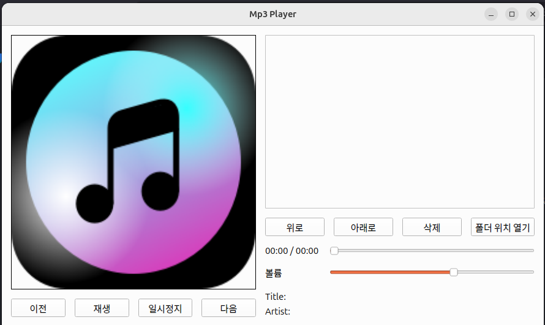

# mp3player

remove.sh my3player.deb 내용 삭제 프로그램 입니다

pip install PySide6 --break-system-packages

pip install python-vlc --break-system-packages

설치하면 python3 mpeplayer.py 하면 실행됨 실행 파일도 모듈 오류나면 설치하면실행됨
dpkg -i mp3player.deb 
 pip install PySide6 --break-system-packages 이것과 pip install python-vlc --break-system-packages
설치하면 실행됨

가상 환경만 실행 하고 싶으면
python venv mp3player 
source mp3player/bin/activate
에서 실행 하면 사용됨
테스트 환경은 우분투 24.04

